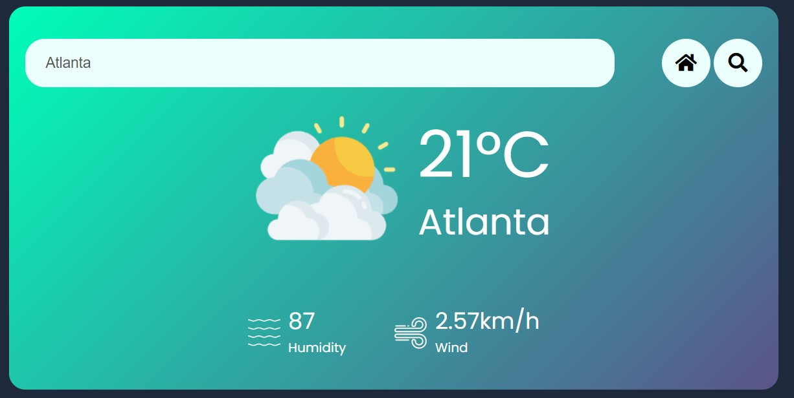

# Weather App
## Overview
This Weather App is a web application that provides real-time weather information for a specified city. It utilizes the OpenWeather API to fetch weather data and display it in a user-friendly interface. Here, we'll discuss the skills and techniques showcased in building this Weather App.

## Features
1. **API Integration:** The Weather App integrates with the OpenWeather API to fetch weather data based on the user location (home button) or an user-provided city name (search button).

2. **Asynchronous JavaScript:** The use of async/await ensures that API requests are made asynchronously, preventing the application from freezing while waiting for a response from the server.

3. **Dynamic User Interface:** The app dynamically updates the user interface with weather data, including temperature, humidity, wind speed, and an appropriate weather icon. Further, the background is changed according to the weather:

4. **Icon Mapping:** A switch statement is used to map weather conditions to corresponding weather icons, providing visual cues to users about the current weather.

5. **Event Handling:** Event listeners are implemented to handle user interactions, such as clicking the search button to retrieve weather data.

## Usage
Obtain an API key from OpenWeather.

Replace `YOUR_API_KEY` within `script.js` with your actual API key.

Open the HTML file in a web browser.

Enter a city name in the search input field and click the search button to fetch weather data.

The app will display weather information for the specified city, including temperature, humidity, wind speed, and a weather icon.

## Conclusion
The Weather App demonstrates the use of modern web development techniques, including API integration, asynchronous JavaScript, dynamic UI updates, error handling, and event handling. By creating this app, you have gained valuable experience in building web applications that interact with external APIs and provide real-time data to users.